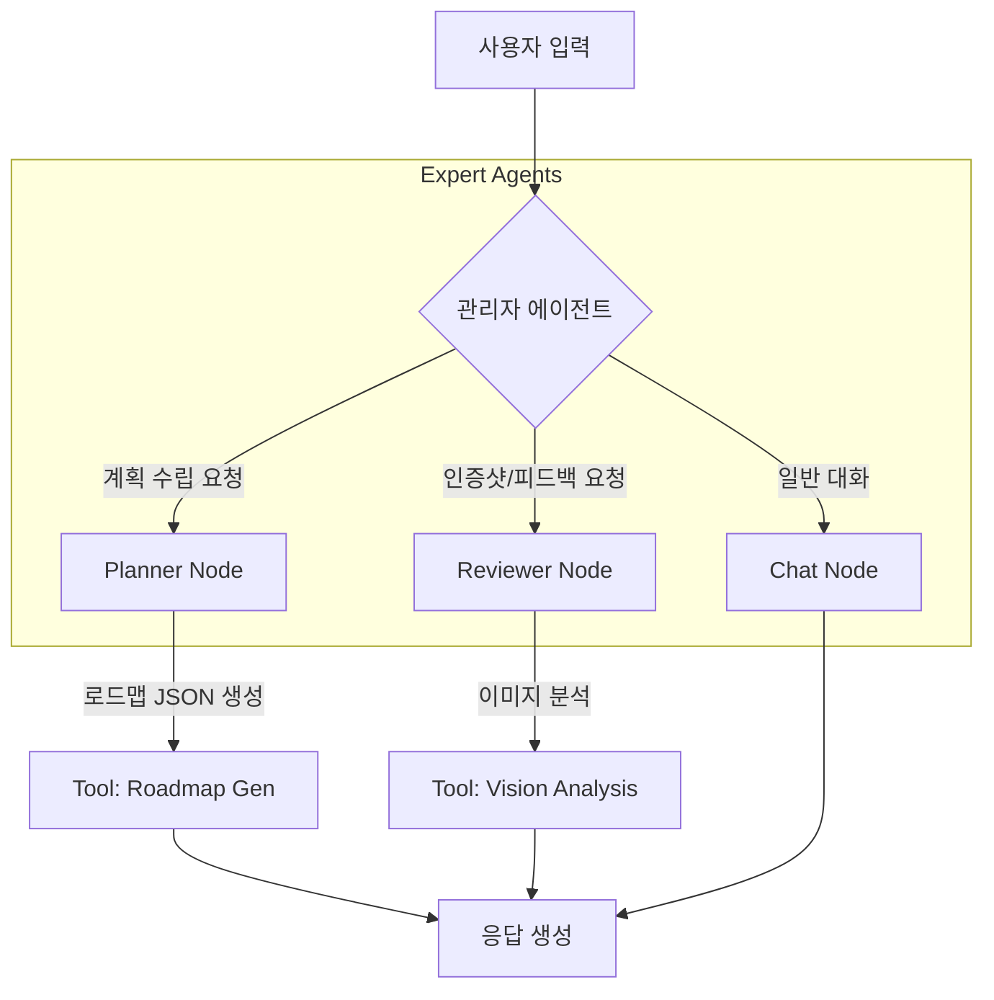

# 🚀 AI 자기 계발 코치 (Project: Grow)

> **"FastAPI와 LangGraph로 구현한 에이전트 기반 멀티모달 학습 코칭 플랫폼"**

사용자의 목표를 분석하여 구조화된 학습 로드맵을 설계하고, 이미지 인식(Vision) 기술을 통해 학습 인증 및 피드백을 제공하는 **능동형 AI 에이전트 서비스**입니다.

## 1\. 📖 프로젝트 개요

  * **프로젝트명:** AI Personal Growth Coach (Code Name: Grow)
  * **개발 기간:** 2025.XX.XX \~ (진행 중)
  * **개발 인원:** 1인 (Full-Stack)
  * **개발 환경:** Python 3.11.14
  * **핵심 목표:**
      * **Agentic Workflow:** 단순 LLM 호출이 아닌, LangGraph를 활용한 상태 기반(Stateful) 멀티 에이전트 시스템 구현
      * **Asynchronous Server:** FastAPI의 비동기 처리를 통해 다중 요청에도 끊김 없는 사용자 경험 제공
      * **Multi-modal Feedback:** Vision API를 활용하여 텍스트뿐만 아니라 이미지(학습 노트, 인증샷) 기반 코칭 제공

## 2\. 🛠️ 기술 스택 (Tech Stack)

| 구분 | 기술 (Version) | 선정 이유 |
| :--- | :--- | :--- |
| **Backend** | **FastAPI** (0.109+) | 비동기(Async) 처리 지원 및 Pydantic을 통한 강력한 데이터 검증 |
| **AI Orchestration** | **LangChain & LangGraph** | 멀티 에이전트(Supervisor-Node) 구조 설계 및 대화 상태(State) 관리 |
| **LLM / Vision** | OpenAI GPT-4o / Gemini | 복잡한 추론 및 멀티모달(이미지) 분석 |
| **Frontend** | **Jinja2 Templates** | 별도 FE 프레임워크 없이 Python 친화적인 SSR(Server Side Rendering) 구현 |
| **Data Management** | **Pandas & JSON/CSV** | 로컬 파일 시스템을 활용한 NoSQL 형태의 경량 데이터 관리 |
| **Environment** | Python 3.11.14 | 최신 라이브러리 호환성 및 안정성 확보 |

## 3\. 🧠 시스템 아키텍처 (System Architecture)

이 프로젝트는 단일 체인(Chain)이 아닌, **중앙 관리자(Supervisor)가 각 전문가 에이전트에게 작업을 분배하는 구조**를 가집니다.

### 3.1. LangGraph 에이전트 흐름도



  * **Supervisor:** 사용자의 의도를 분류(Classification)하여 적절한 에이전트로 라우팅합니다.
  * **Planner Agent:** 목표와 수준을 분석하여 JSON 포맷의 커리큘럼을 생성합니다.
  * **Reviewer Agent:** 업로드된 이미지를 분석하고 학습 내용을 평가합니다.

### 3.2. FastAPI 서버 구조

  * **MVC 패턴(유사):** `Router`(Controller) - `Service`(Model/Logic) - `Template`(View) 구조로 분리하여 유지보수성 강화.

## 4\. 📂 디렉토리 구조 (Directory Structure)

```bash
my-ai-coach/
 ├── main.py                # [Entry] FastAPI 앱 실행 포인트
 ├── requirements.txt       # 의존성 패키지 목록
 ├── .env                   # API Key 등 환경 변수
 ├── app/
 │   ├── __init__.py
 │   ├── api/               # 엔드포인트 (라우터)
 │   │   └── endpoints.py   # /, /plan, /chat 등 라우팅 정의
 │   ├── core/              # 핵심 설정
 │   │   └── config.py      # 환경설정 로드
 │   ├── schemas/           # [Pydantic] 데이터 입출력 모델 정의
 │   │   ├── roadmap.py     # 로드맵 데이터 검증 모델
 │   │   └── chat.py        # 채팅 메시지 모델
 │   ├── services/          # 비즈니스 로직 (파일 I/O 등)
 │   │   └── data_service.py
 │   └── agents/            # [LangGraph] AI 에이전트 정의
 │       ├── graph.py       # 그래프 워크플로우 정의
 │       ├── nodes.py       # 각 노드(Planner, Reviewer) 함수
 │       └── tools.py       # 실제 LLM 호출 및 기능 함수
 ├── static/                # CSS, JS, Uploaded Images
 │   ├── css/
 │   ├── js/
 │   └── uploads/
 ├── templates/             # HTML 화면 (Jinja2)
 │   ├── base.html
 │   ├── index.html
 │   └── chat.html
 └── data/                  # 로컬 데이터 저장소
     ├── roadmap.json
     ├── study_log.csv
     └── user_profile.json
```

## 5\. 💾 데이터 모델 (Data Schema)

### A. 학습 로드맵 (`roadmap.json`)

Planner Agent가 생성하는 구조화된 데이터입니다.

```json
{
  "project_title": "FastAPI 마스터",
  "curriculum": [
    {
      "week": 1,
      "theme": "기초 다지기",
      "missions": [
        {"id": "w1_m1", "title": "Pydantic 이해하기", "is_completed": false}
      ]
    }
  ]
}
```

### B. 학습 기록 (`study_log.csv`)

시계열 데이터 분석을 위해 CSV로 관리합니다.

  * **Columns:** `date`, `week`, `mission_id`, `content`(텍스트 요약), `image_path`, `ai_feedback`, `satisfaction`

## 6\. 🚀 설치 및 실행 가이드 (Installation)

**1. 저장소 클론 및 이동**

```bash
git clone [repository_url]
cd my-ai-coach
```

**2. 가상환경 생성 (Python 3.11.14)**

```bash
python -m venv venv
# Windows
venv\Scripts\activate
# Mac/Linux
source venv/bin/activate
```

**3. 의존성 설치**

```bash
pip install -r requirements.txt
```

**4. 환경 변수 설정**
`.env` 파일을 생성하고 API 키를 입력합니다.

```text
OPENAI_API_KEY=sk-proj-...
# 또는
GOOGLE_API_KEY=AIza...
```

**5. 서버 실행**
Uvicorn을 사용하여 비동기 서버를 실행합니다.

```bash
uvicorn main:app --reload
```

  * 브라우저에서 `http://127.0.0.1:8000` 접속

## 7\. 💡 주요 기능 (Features)

1.  **맞춤형 로드맵 생성:** 사용자의 수준/목표/기간을 입력하면 LangGraph의 **Planner Node**가 개인화된 JSON 계획표를 작성.
2.  **실시간 코칭 채팅:** **Chat Node**가 현재 진행 중인 주차(Week)와 미션 정보를 기억(Context Aware)하고 답변.
3.  **멀티모달 인증:** 노트 필기나 모니터 화면을 찍어 올리면 **Reviewer Node**가 Vision 모델로 분석하여 칭찬 및 보완점 피드백.
4.  **대시보드 & 게이미피케이션:** 학습 현황 시각화 및 미션 완료 시 배지/경험치 시스템(예정).

-----

### 📝 License

This project is licensed under the MIT License.

-----

### 👨‍💻 Author

  * **Name:** [Your Name]
  * **Role:** AI Engineer / Full-Stack Developer
  * **Contact:** [Your Email]